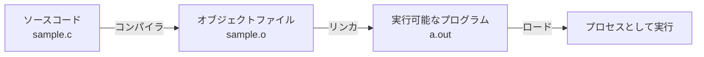

# RubyKaigi 2025 予習Bootcamp

2025/03/07 MS芝浦ビル

---
layout: center
---

# おはようございます！！

---
layout: center
---

# 今日はRubyについてとことん学んでもらいます

---
layout: center
---

# なぜか

---
title: rubykaigi ogp
layout: image
image: rubykaigi-ogp.jpg
---

---
layout: center
---

# Ruby のことを知らないと、 RubyKaigiは楽しめない

---
layout: center
---

  

---
layout: center
---

# RubyKaigiを全力で楽しみ・実りある会にする

そして、そのためには皆さんが主体的に取り組む必要があります

---
layout: center
---

# 熱くてワクワクするような1日にしていきましょう！！💪

---
layout: default
---

# 今日のお品書き
## 午前の部

Rubyの言語処理系について全体像を把握してもらいます

<ul class="text-xl">
  <li>プログラミング言語処理系の前提知識</li>
  <li>Rubyの言語処理系におけるプロセスの全体像</li>
</ul>

## 午後の部

より各論的な内容にDeepDiveしていきます

<ul class="text-xl">
  <li>Parser周り: Prism, Lrama...</li>
  <li>並行・並列処理: スレッド/プロセス, 排他処理, イベント駆動, Fiber, Ractor...</li>
  <li>JITコンパイラの動向: RJIT, YJIT, LBBV, ...</li>
</ul>

---
layout: center
---

# さてさて、

---
layout: center
---

# ruby -e "puts 7 + 8"

このコードを適当なターミナルエミュレータから実行すると...

---
layout: center
---

# 15 ですよね

---
layout: center
---

<h1 class="font-bold text-2xl text-black"> でも、<strong class="text-4xl text-black">なぜ？</strong></h1>

---
layout: cover
---

  
  <h2 class='m-auto mx-0'> 
    なぜ？を考える上では、 
    ティンバーゲンの4つの問いで整理できる
  </h2>

---
layout: default
---

# ティンバーゲンの4つの問い

||静的|動的|
|-|---|----|
|至近要因|メカニズムとしてのなぜ|適応としてとしてのなぜ|
|究極要因|発生|進化|

---
layout: default
---

  <h1>例:シジュウカラは春になぜ鳴くのか？</h1>
  

||静的|動的|
|-|---|----|
|至近要因|メカニズムとしてのなぜ: 季節の変化をどのようにして知るのか？どのようなホルモンが歌生成を促すのか？|適応としてのなぜ: 歌は、なわばりの維持や配偶獲得という点で、繁殖成功率をどの程度上昇させるか？|
|究極要因|発生:  ヒナから成長してくる間に、鳴き声はどのようにして歌に変わるのか？|進化:  祖先の鳥からの系統において、歌の能力やパターンはどのように変化したのか？|

---
layout: center
---

<h1 class='!mb-4'>今日のBootcampでは Rubyのメカニズムとしてのなぜ を突き詰めていきます</h1>

そしてその過程でRubyというソフトウェアが どのように発達/進化(<strong>Develop</strong>)してきたのかの一端を垣間見てほしいです

---
layout: center
---

# 「プログラムを実行する」ということについて考えてみます

---
layout: center
---

  <h1>プログラムを実行するには処理系が必要ですね</h1>
  
言語仕様と処理系は分けなければいけない。Rubyのソースが動かせるからといって、他の人との処理系と同じかと言われると異なる

---
layout: default
---

# Rubyの言語処理系について
<h2> CRuby (MRI)</h2>

Matzが作ったRuby, 所謂Ruby
MRI (Matz' Ruby Implementation)

## JRuby

Java言語で実装されたRubyの処理系。
RubyのコードをクロスプラットフォームであるJVM（Java Virtual Machine）上で実行でき、Rubyで実装されたコード上でJavaのライブラリが利用可能である。インタプリタ・実行時コンパイラ・事前コンパイラ の3種類が用意されている。

[他にもたくさん](https://www.ruby.or.jp/ja/tech/install/ruby/implementations)

---
layout: default
---
# インタプリタ型言語の基本

ランタイムで逐次的にソースを解釈して実行するインタプリタ言語では、 基本的には下記のような流れをとります

<v-click>

この流れが基本中の基本なので覚えましょう！

</v-click>

---
layout: default
---
# 参考）コンパイル型言語だと？

事前にコンパイルされるコンパイル型言語（AOT、Ahead of Timeとか言ったりします）だと 下記のような作り方をします

実際には、近年だと<a href='https://llvm.org/' target='_blank'>LLVM</a>と呼ばれる基盤の上で、最適化に最適化を重ねているのでもっと複雑です 
作る側はLLVMに合わせて中間表現を吐き出せばいいので、クロスプラットフォーム対応しやすいメリットがあります

  

---
layout: default
---
# CRubyも同じ流れをとります

Ruby1.8まで: 基本はさっきの内容と<strong>同じ</strong>

---
layout: default
---
# CRubyも同じ流れをとります(2回目)

<!-- VMの紹介 -->

Ruby1.8まで: 基本はさっきの内容と<strong>同じ</strong>

<v-click>

Ruby 1.9(2007-12-25リリース)以降: VMが追加された

</v-click>

