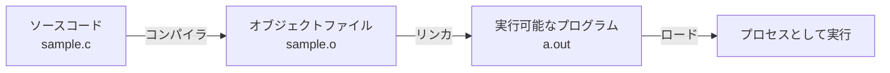

# RubyKaigi 2025 予習Bootcamp

2025/03/07 MS芝浦ビル

---
layout: center
---

# おはようございます！！


---
layout: center
---

# 今日はRubyについてとことん学んでもらいます

---
layout: center
---

# なぜか

---
title: rubykaigi ogp
layout: image
image: rubykaigi-ogp.jpg
---


---
layout: center
---

# Ruby のことを知らないと、<br/>RubyKaigiは楽しめない

---
layout: center
---

<div class='flex justify-center' >
  
</div>


---
layout: center
---

# RubyKaigiを全力で楽しみ・実りある会にする

<p class='text-2xl'>そして、そのためには皆さんが主体的に取り組む必要があります</p>

---
layout: center
---

# 熱くてワクワクするような1日にしていきましょう！！💪


---
layout: default
---

# 今日のお品書き
## 午前の部
<p class="text-2xl text-black">Rubyの言語処理系について全体像を把握してもらいます</p>
<ul class="text-xl">
  <li>プログラミング言語処理系の前提知識</li>
  <li>Rubyの言語処理系におけるプロセスの全体像</li>
</ul>

## 午後の部
<p class="text-2xl text-black">より各論的な内容にDeepDiveしていきます</p>
<ul class="text-xl">
  <li>Parser周り: Prism, Lrama...</li>
  <li>並行・並列処理: スレッド/プロセス, 排他処理, イベント駆動, Fiber, Ractor...</li>
  <li>JITコンパイラの動向: RJIT, YJIT, LBBV, ...</li>
</ul>


---
layout: center
---

# さてさて、


---
layout: center
---

# ruby -e "puts 7 + 8"
<p class="text-xl">このコードを適当なターミナルエミュレータから実行すると...</p>


---
layout: center
---

# 15 <span class="text-xl">ですよね</span>


---
layout: center
---

<h1 class="font-bold text-2xl text-black"> でも、<strong class="text-4xl text-black">なぜ？</strong></h1>


---
layout: cover
---

<div class='flex flex-row gap-4 justify-center'>
  <div class='flex flex-col items-center'>
    
    <a class='text-sm' href='https://ja.wikipedia.org/wiki/%E3%83%8B%E3%82%B3%E3%83%BB%E3%83%86%E3%82%A3%E3%83%B3%E3%83%90%E3%83%BC%E3%82%B2%E3%83%B3' target='_blank'>
      <span class='italic'>Nikolaas Tinbergen</span><br>オランダの動物行動学者・鳥類学者
    </a>
  </div>
  <h2 class='m-auto mx-0'> 
    なぜ？<span class="text-xl">を考える上では、</span><br/>
    ティンバーゲンの4つの問い<span class="text-xl">で整理できる</span>
  </h2>
</div>

---
layout: default
---

# ティンバーゲンの4つの問い

||<span class="font-bold">静的</span>|<span class="font-bold">動的</span>|
|-|---|----|
|至近要因|<span class="font-bold">メカニズムとしてのなぜ</span>|<span class="font-bold">適応としてのなぜ</span>|
|究極要因|<span class="font-bold">発生</span>|<span class="font-bold">進化</span>|

<a class='inline-block italic text-right' href='https://onlinelibrary.wiley.com/doi/abs/10.1111/j.1439-0310.1963.tb01161.x' target='_blank'>
  Tinbergen, N. (1963). On aims and methods of ethology.
</a>

---
layout: default
---

<div class="flex flex-row">
  <h1>例:シジュウカラは春になぜ鳴くのか？</h1>
  
</div>

||<span class="font-bold">静的</span>|<span class="font-bold">動的</span>|
|-|---|----|
|至近要因|<span class="font-bold">メカニズムとしてのなぜ:</span><br/><span class="text-xl">季節の変化をどのようにして知るのか？どのようなホルモンが歌生成を促すのか？</span>|<span class="font-bold">適応としてのなぜ</span>:<br/><span class="text-xl">歌は、なわばりの維持や配偶獲得という点で、繁殖成功率をどの程度上昇させるか？</span>|
|究極要因|<span class="font-bold">発生:</span><br/><span class="text-xl"> ヒナから成長してくる間に、鳴き声はどのようにして歌に変わるのか？</span>|<span class="font-bold">進化:</span><br/><span class="text-xl"> 祖先の鳥からの系統において、歌の能力やパターンはどのように変化したのか？</span>|


---
layout: center
---

<h1 class='!mb-6'>
  <span class="text-xl">今日のBootcampでは</span>
  <br>
  <span v-mark.underline.red>
  Rubyのメカニズムとしてのなぜ
  </span>
  <span class="text-xl">を突き詰めていきます</span>
</h1>

<v-click>
  <p class="text-2xl text-black">そしてその過程でRubyというソフトウェアが<br/>どのように発達/進化(<strong>Develop</strong>)してきたのかの一端を垣間見てほしいです</p>
</v-click>


---
layout: center
---

# 「プログラムを実行する」ということについて考えてみます

---
layout: default
---

<h1>プログラムを実行するには処理系が必要ですね</h1>
<div class='flex'>
  <div class='basis-1/2'>
    <p class='text-2xl'>大前提：<strong>言語仕様と処理系は別物</strong> </p>
    <p class='text-xl'>同じRubyのソースが動かせるからといって、他の環境との処理系が同じである保証はない</p>
  </div>
  <div class='basis-1/2'>
    
  </div>
</div>


---
layout: default
---

# Rubyの言語処理系について
<h2> <span  v-mark.circle.orange>CRuby (MRI)</span></h2>
<p class='text-xl'>
  Matzが作ったRuby, <strong>MRI (Matz' Ruby Implementation)</strong>
</p>
<p>
  MRIが実質的にRubyの言語仕様になっている<br><strong>->MRIで取り込まれた機能がRubyの言語仕様として採用される</strong>
</p>


## JRuby
<p class='text-xl'>
Java言語で実装されたRubyの処理系。
RubyのコードをクロスプラットフォームであるJVM（Java Virtual Machine）上で実行でき、Rubyで実装されたコード上でJavaのライブラリが利用可能である。インタプリタ・実行時コンパイラ・事前コンパイラ の3種類が用意されている。
</p>

[他にもたくさん](https://www.ruby.or.jp/ja/tech/install/ruby/implementations)


---
layout: default
---
# インタプリタ型言語の基本

<p class='text-xl'>
ランタイムで逐次的にソースを解釈して実行するインタプリタ言語では、<br/>基本的には下記のような流れをとります
</p>
<div class='w-full flex justify-center mt-16'>

</div>

<v-click>
<p class='text-2xl text-center'>
意外とシンプルですね<br/><span class='font-bold'>この流れが基本中の基本なので覚えましょう！</span>
</p>
</v-click>


---
layout: default
---
# 参考）コンパイル型言語だと？

<p class='text-xl'>
事前にコンパイルされるコンパイル型言語（AOT、Ahead of Timeとか言ったりします）だと<br/>下記のような作り方をします
</p>
<div class='w-full flex justify-center'>

</div>

<p class='text-xl'>
実際のところ、近年だと<a href='https://llvm.org/' target='_blank'>LLVM</a>と呼ばれる基盤の上で、中間表現を挟みながら最適化に最適化を重ねているのでもっと複雑です。
作る側はLLVMに合わせて中間表現を吐き出せばいいので、<strong>クロスプラットフォーム対応しやすい</strong>メリットがあります
</p>
<div class='w-full flex justify-center'>
  
</div>


---
layout: default
---
# CRubyが実行されるまでのステップ

<p class='text-xl'>
<span>Ruby1.8まで:</span> 基本はさっきの内容と<strong>同じ</strong>
</p>
<div class='w-full flex justify-center mt-16'>

</div>

<v-click>
  <p class='text-2xl text-center font-bold'>
  このステップを順に追ってみていきましょう
  </p>
</v-click>


---
layout: default
---
# 字句解析

TODO: tokenを吐き出してみる(演習)


---
layout: default
---
# 構文解析

TODO: ASTを吐き出してみる(演習)

---
layout: default
---
# この辺の話は午後の部で松舘から

TODO: 松舘のSlack写真をはって、吹き出しつけておく


---
layout: default
---
# 解釈・実行

Tree-Walkingで実行する<br/>
ひたすら長いcase文があって、再帰的に`eval`を叩いていく

``` rb
# 処理のイメージなので実際には動かない
def eval(node)
  case node[:type]  # ノードの種類で分岐
  when 'integer'# 数値リテラル
    node[:value]  
  when 'true', 'false' # 真偽値
    # ...
  when 'array' # 配列
    node[:entries].map { |entry| eval(entry) }  # 各要素を再帰的に評価
  when 'prefix-expr' # 前置演算子の処理をする
    left = eval(node[:left])
    right = eval(node[:right])
    # ...
  when 'infix-expr' # 前置演算子の処理をする
    right = eval(node[:right])
    # ...
  end
end
```


---
layout: default
---
# CRubyが実行されるまでのステップ

<!-- VMの紹介 -->

<p class='text-xl'>
<span>Ruby1.8まで:</span>
</p>
<div class='w-full flex justify-center mt-16'>

</div>

<v-click>
<p class='text-xl'>
  <strong>Ruby 1.9</strong>から: 高速化を目的としてVMが追加された
  <span class='text-sm'>(2007-12-25リリース)</span>
</p>
<div class='w-full flex justify-center mt-16'>

</div>
</v-click>

<v-click>
  <p class='text-2xl text-center'>
    このVMのことを
    <strong>
      YARV(Yet Another Ruby VM)
    </strong>
    と呼びます
  </p>
</v-click>
