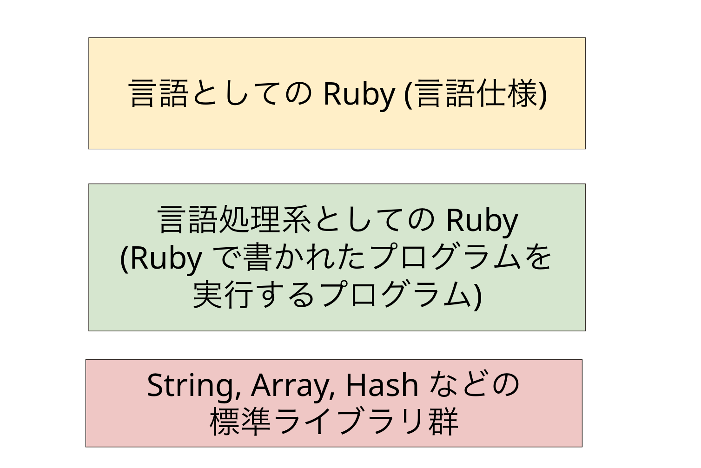
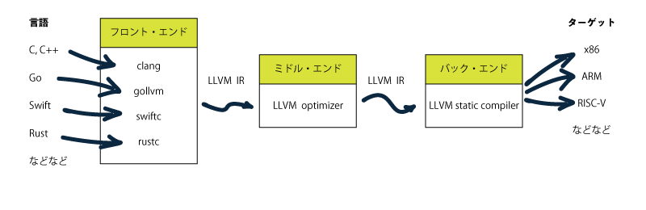

# RubyKaigi 2025 予習Bootcamp

2025/03/07 MS芝浦ビル

---
layout: center
---

# おはようございます！！


---
layout: center
---

# 今日はRubyについてとことん学んでもらいます

---
layout: center
---

# なぜか

---
title: rubykaigi ogp
layout: image
image: rubykaigi-ogp.jpg
---


---
layout: center
---

# Ruby のことを知らないと、<br/>RubyKaigiは楽しめない

---
layout: center
---

<div class='flex justify-center' >
  
</div>


---
layout: center
---

# RubyKaigiを全力で楽しみ・実りある会にする

<p class='text-2xl'>そして、そのためには皆さんが主体的に取り組む必要があります</p>

---
layout: center
---

# 熱くてワクワクするような1日にしていきましょう！！💪


---
layout: default
---

# 今日のお品書き
<v-click>
  <h2> 午前の部 </h2>
  <p class="text-2xl text-black">Rubyの言語処理系について<strong>全体像</strong>を把握してもらいます</p>
  <v-click>
    <ul class="text-xl">
      <li>プログラミング言語処理系の前提知識</li>
      <li>Rubyの言語処理系におけるステップの全体像</li>
    </ul>
  </v-click>
</v-click>

<v-click>
  <h2> 午後の部 </h2>
  <p class="text-2xl text-black"><strong>より各論的な内容にDeepDive</strong>していきます</p>
  <v-click>
    <ul class="text-xl">
      <li>Parser周り: Prism, Lrama...</li>
      <li>並行・並列処理: スレッド/プロセス, 排他処理, イベント駆動, Fiber, Ractor...</li>
      <li>JITコンパイラの動向: RJIT, YJIT, LBBV, ...</li>
    </ul>
  </v-click>
</v-click>

---
layout: center
---

# さてさて、


---
layout: center
---

# ruby -e "puts 7 + 8"
<p class="text-xl">このコードを適当なターミナルエミュレータから実行すると...</p>


---
layout: center
---

# 15 <span class="text-xl">ですよね</span>


---
layout: center
---

<h1 class="font-bold text-2xl text-black"> でも、<strong class="text-4xl text-black">なぜ？</strong></h1>


---
layout: cover
---

<div class='flex flex-row gap-4 justify-center'>
  <div class='flex flex-col items-center'>
    
    <a class='text-sm' href='https://ja.wikipedia.org/wiki/%E3%83%8B%E3%82%B3%E3%83%BB%E3%83%86%E3%82%A3%E3%83%B3%E3%83%90%E3%83%BC%E3%82%B2%E3%83%B3' target='_blank'>
      <span class='italic'>Nikolaas Tinbergen</span><br>オランダの動物行動学者・鳥類学者
    </a>
  </div>
  <h2 class='m-auto mx-0'> 
    なぜ？<span class="text-xl">を考える上では、</span><br/>
    ティンバーゲンの4つの問い<span class="text-xl">で整理できる</span>
  </h2>
</div>

---
layout: default
---

# ティンバーゲンの4つの問い

||<span class="font-bold">至近要因</span>|<span class="font-bold">究極要因</span>|
|-|---|----|
|静的|<span class="font-bold">メカニズムとしてのなぜ</span>|<span class="font-bold">適応としてのなぜ</span>|
|動的|<span class="font-bold">発生</span>|<span class="font-bold">進化</span>|

<a class='inline-block italic text-right' href='https://onlinelibrary.wiley.com/doi/abs/10.1111/j.1439-0310.1963.tb01161.x' target='_blank'>
  Tinbergen, N. (1963). On aims and methods of ethology.
</a>

---
layout: default
---

<div class="flex flex-row">
  <h1>例:シジュウカラは春になぜ鳴くのか？</h1>
  
</div>

||<span class="font-bold">至近要因</span>|<span class="font-bold">究極要因</span>|
|-|---|----|
|静的|<span class="font-bold">メカニズムとしてのなぜ:</span><br/><span class="text-xl">季節の変化をどのようにして知るのか？どのようなホルモンが歌生成を促すのか？</span>|<span class="font-bold">適応としてのなぜ</span>:<br/><span class="text-xl">歌は、なわばりの維持や配偶獲得という点で、繁殖成功率をどの程度上昇させるか？</span>|
|動的|<span class="font-bold">発生:</span><br/><span class="text-xl"> ヒナから成長してくる間に、鳴き声はどのようにして歌に変わるのか？</span>|<span class="font-bold">進化:</span><br/><span class="text-xl"> 祖先の鳥からの系統において、歌の能力やパターンはどのように変化したのか？</span>|


---
layout: center
---

<h1 class='!mb-6'>
  <span class="text-xl">今日のBootcampでは</span>
  <br>
  <span v-mark.underline.red>
  Rubyのメカニズムとしてのなぜ
  </span>
  <span class="text-xl">を突き詰めていきます</span>
</h1>

<v-click>
  <p class="text-2xl text-black">そしてその過程でRubyというソフトウェアが<br/>どのように発達/進化(<strong>Develop</strong>)してきたのかの一端を垣間見てほしいです</p>
</v-click>


---
layout: center
---

# 「プログラムを実行する」ということについて考えてみます

---
layout: default
---

<h1>プログラムを実行するには処理系が必要ですね</h1>
<div class='flex'>
  <div class='basis-1/2'>
    <p class='text-2xl'>大前提：<strong>言語仕様と処理系は別物</strong> </p>
    <p class='text-xl'>同じRubyのソースが動かせるからといって、他の環境との処理系が同じである保証はない</p>
  </div>
  <div class='basis-1/2'>
    
  </div>
</div>


---
layout: default
---

# Rubyの言語処理系について
<h2> <span  v-mark.circle.orange>CRuby (MRI)</span></h2>
<p class='text-xl'>
  Matzが作ったRuby, <strong>MRI (Matz' Ruby Implementation)</strong>
</p>
<p>
  MRIが実質的にRubyの言語仕様になっている<br><strong>->MRIで取り込まれた機能がRubyの言語仕様として採用される</strong>
</p>


## JRuby
<p class='text-xl'>
Java言語で実装されたRubyの処理系。
RubyのコードをクロスプラットフォームであるJVM（Java Virtual Machine）上で実行でき、Rubyで実装されたコード上でJavaのライブラリが利用可能である。インタプリタ・実行時コンパイラ・事前コンパイラ の3種類が用意されている。
</p>

[他にもたくさん](https://www.ruby.or.jp/ja/tech/install/ruby/implementations)


---
layout: default
---
# インタプリタ型言語の基本

<p class='text-xl'>
ランタイムで逐次的にソースを解釈して実行するインタプリタ言語では、<br/>基本的には下記のような流れをとります
</p>
<div class='w-full flex justify-center mt-16'>

</div>

<v-click>
<p class='text-2xl text-center'>
意外とシンプルですね<br/><span class='font-bold'>この流れが基本中の基本なので覚えましょう！</span>
</p>
</v-click>


---
layout: default
---
# 参考）コンパイル型言語だと？

<p class='text-xl'>
事前にコンパイルされるコンパイル型言語（AOT、Ahead of Timeとか言ったりします）だと<br/>下記のような作り方をします
</p>
<div class='w-full flex justify-center'>

</div>

<p class='text-xl'>
実際のところ、近年だと<a href='https://llvm.org/' target='_blank'>LLVM</a>と呼ばれる基盤の上で、中間表現を挟みながら最適化に最適化を重ねているのでもっと複雑です。
作る側はLLVMに合わせて中間表現を吐き出せばいいので、<strong>クロスプラットフォーム対応しやすい</strong>メリットがあります
</p>
<div class='w-full flex justify-center'>
  
</div>


---
layout: default
---
# CRubyが実行されるまでのステップ

<p class='text-xl'>
<span>Ruby1.8まで:</span> 基本はさっきの内容と<strong>同じ</strong>
</p>
<div class='w-full flex justify-center mt-16'>

</div>

<v-click>
  <p class='text-2xl text-center font-bold'>
  このステップを順に追ってみていきましょう
  </p>
</v-click>


---
layout: default
---
# 字句解析

<p class='text-xl'>
  ソースをトークンとして分解する
</p>

``` rb
require 'ripper'

example = <<~EXAMPLE
  def foo(a,b)
    puts a + b
  end
  foo(9,8)
EXAMPLE

pp Ripper.lex(example)
```
<v-click>
  <p class='text-2xl text-center font-bold'>手元で叩いてみよう↑</p>
</v-click>


---
layout: default
---

<p class='text-xl'>
  [line number, column number], token type, lexeme, tokenを読み取った時の状態
</p>

```rb {*}{maxHeight: '400px', class:'!children:text-xs'}
[[[1, 0], :on_kw, "def", FNAME],
 [[1, 3], :on_sp, " ", FNAME],
 [[1, 4], :on_ident, "foo", ENDFN],
 [[1, 7], :on_lparen, "(", BEG|LABEL],
 [[1, 8], :on_ident, "a", ARG],
 [[1, 9], :on_comma, ",", BEG|LABEL],
 [[1, 10], :on_ident, "b", ARG],
 [[1, 11], :on_rparen, ")", ENDFN],
 [[1, 12], :on_ignored_nl, "\n", BEG],
 [[2, 0], :on_sp, "  ", BEG],
 [[2, 2], :on_ident, "puts", CMDARG],
 [[2, 6], :on_sp, " ", CMDARG],
 [[2, 7], :on_ident, "a", END|LABEL],
 [[2, 8], :on_sp, " ", END|LABEL],
 [[2, 9], :on_op, "+", BEG],
 [[2, 10], :on_sp, " ", BEG],
 [[2, 11], :on_ident, "b", END|LABEL],
 [[2, 12], :on_nl, "\n", BEG],
 [[3, 0], :on_kw, "end", END],
 [[3, 3], :on_nl, "\n", BEG],
 [[4, 0], :on_ident, "foo", CMDARG],
 [[4, 3], :on_lparen, "(", BEG|LABEL],
 [[4, 4], :on_int, "9", END],
 [[4, 5], :on_comma, ",", BEG|LABEL],
 [[4, 6], :on_int, "8", END],
 [[4, 7], :on_rparen, ")", ENDFN],
 [[4, 8], :on_nl, "\n", BEG]]
```

---
layout: default
---
# CRubyが実行されるまでのステップ

<div class='w-full flex justify-center mt-16'>

</div>

<v-click>
  <p class='text-2xl text-center font-bold'>
  トークン列ができた
  </p>
</v-click>

---
layout: default
---
# 構文解析

<p class='text-xl'>
  分解したトークンに意味を与え、抽象構文木（Abstract Syntax Tree, AST）を作る
</p>

``` rb
require 'ripper'

example = <<~EXAMPLE
  def foo(a,b)
    puts a + b
  end
  foo(9,8)
EXAMPLE

pp Ripper.sexp(example)
```

<v-click>
  <p class='text-2xl text-center font-bold'>手元で叩いてみよう↑</p>
</v-click>

---
layout: default
---

<p class='text-xl'>
  下記のような意味を持つ<br>
  [line number, column number], token type, lexeme, tokenを読み取った時の状態
</p>

```rb {*}{maxHeight: '400px', class:'!children:text-xs'}
[:program,
 [[:def,
   [:@ident, "foo", [1, 4]],
   [:paren,
    [:params,
     [[:@ident, "a", [1, 8]], [:@ident, "b", [1, 10]]],
     nil,nil,nil,nil,nil,nil]],
   [:bodystmt,
    [[:command,
      [:@ident, "puts", [2, 2]],
      [:args_add_block,
       [[:binary,
         [:var_ref, [:@ident, "a", [2, 7]]],
         :+,
         [:var_ref, [:@ident, "b", [2, 11]]]]],
       false]]],nil,nil,nil]],
  [:method_add_arg,
   [:fcall, [:@ident, "foo", [4, 0]]],
   [:arg_paren,
    [:args_add_block, [[:@int, "9", [4, 4]], [:@int, "8", [4, 6]]], false]]]]]
```


---
layout: default
---
# CRubyが実行されるまでのステップ

<div class='w-full flex justify-center mt-16'>

</div>

<v-click>
  <p class='text-2xl text-center font-bold'>
  ASTができた
  </p>
</v-click>


---
layout: center
---
# 字句解析・構文解析の続きは午後の部で松舘から


---
layout: default
---
# 解釈・実行

Tree-Walkingで実行する<br/>
ひたすら長いcase文があって、再帰的に`eval`を叩いていく

``` rb
# 処理のイメージなので実際には動かない
def eval(node)
  case node[:type]  # ノードの種類で分岐
  when 'integer'# 数値リテラル
    node[:value]  
  when 'true', 'false' # 真偽値
    # ...
  when 'array' # 配列
    node[:entries].map { |entry| eval(entry) }  # 各要素を再帰的に評価
  when 'prefix-expr' # 前置演算子の処理をする
    left = eval(node[:left])
    right = eval(node[:right])
    # ...
  when 'infix-expr' # 前置演算子の処理をする
    right = eval(node[:right])
    # ...
  end
end
```


---
layout: default
---
# CRubyが実行されるまでのステップ

<!-- VMの紹介 -->

<p class='text-xl'>
<span>Ruby1.8まで:</span>
</p>
<div class='w-full flex justify-center mt-16'>

</div>

<v-click>
<p class='text-xl'>
  <strong>Ruby 1.9</strong>から: 高速化を目的としてVMが追加された
  <span class='text-sm'>(2007-12-25リリース)</span>
</p>
<div class='w-full flex justify-center mt-16'>

</div>
</v-click>

<v-click>
  <p class='text-2xl text-center'>
    このVMのことを
    <strong>
      YARV(Yet Another Ruby VM)
    </strong>
    と呼びます
  </p>
</v-click>


---
layout: default
---
# VM
## VMとは
<p class='text-xl'>計算資源のエミュレート。マシンを模倣した仮想なマシン(Virtual Machine)</p>

## VMのメリット
- <p class='text-xl'>Portabilityが高い</p>
- <p class='text-xl'>最適化がかけやすい</p>

## VMの例
- <p class='text-xl'>Java, .NET, Lua, JavaScript(V8)</p>
and more...

---
layout: default
---
# Portability

<div class="flex flex-col">
  <div class="flex justify-center">
``` 
+-----------+  +-----------+  +-----------+
| 言語 P1   |  | 言語 P2   |  | 言語 P3   |
|           |  |           |  |           |
+-----------+  +-----------+  +-----------+
| 環境 E1   |  | 環境 E2   |  | 環境 E3   |
+-----------+  +-----------+  +-----------+
                    ↓
+-----------------------------------------+
|             プログラム言語 P            |
+-----------+--+-----------+--+-----------+
| 中間層 I1 |  | 中間層 I2 |  | 中間層 I3 |
+-----------+  +-----------+  +-----------+
| 環境 E1   |  | 環境 E2   |  | 環境 E3   |
+-----------+  +-----------+  +-----------+
```


  </div>
  <div class='p-4 text-xl flex justify-center flex-col gap-2'>
    <p class='!m-0'>環境単位でn個の処理系を作るのではなく、中間言語で記述された処理系を1つ設ける。</p>
    <p class='!m-0'>Pの処理系をまるごと作るのは大変だけど、<br><strong>中間層であるIの処理系を環境ごとに作るのはそこまで大変ではない</strong>という発想</p>
    <a href='https://magazine.rubyist.net/articles/0007/0007-YarvManiacs.html#fn:1' target='_blank'>ref</a>
  </div>
</div>


---
layout: default
---
# Portability

<div class="flex flex-col">
  <div class="flex justify-center">
``` 
+-----------------------------------------+
|              Ruby プログラム            |
+-----------+--+-----------+--+-----------+
|Ruby 処理系|  |Ruby 処理系|  |Ruby 処理系|
+-----------+  +-----------+  +-----------+
|    C 層   |  |    C 層   |  |    C 層   |
+-----------+  +-----------+  +-----------+
|   Linux   |  |  Mac      |  |  Windows  |
+-----------+  +-----------+  +-----------+
```
  </div>
  <div class='p-4 text-xl text-center'>
    Cで中間言語を処理する環境さえあれば、<br>Rubyを動かすことができる
  </div>
</div>

<v-click>
  <div class='text-2xl text-center'>
    <strong>ここでいう中間言語がVMが処理するバイトコードになる</strong>
    <p class='text-lg'>※各OS/CPUアーキテクチャに対応した処理系を作るより、<br>共通のバイトコードを解釈する VM を作る方が簡単</p>
  </div>
</v-click>

---
layout: default
---

# YARVのバイトコード(ISeq)を理解する
## dumpしてみる
``` rb
example = <<~EXAMPLE
  def foo(a,b)
    puts a + b
  end
  foo(9,8)
EXAMPLE

vm = RubyVM::InstructionSequence
vm.compile_option = false
iseq = vm.compile(example)
puts iseq.disasm

```

<v-click>
  <p class='text-2xl text-center font-bold'>手元で叩いてみよう↑</p>
</v-click>

---
layout: full
---

<div class='flex flex-col justify-center h-full items-center'>
<div class="flex items-center">
<div>
```rb
def foo(a,b)
  ...
end
foo(9,8)
```
</div>
<p class="text-2xl font-bold mx-8">→</p>
<div>
``` {*}{maxHeight: '400px', class:'!children:text-xs'}
== disasm: #<ISeq:<compiled>@<compiled>:1 (1,0)-(4,8)>
0000 definemethod                           :foo, foo                 (   1)[Li]
0003 putself                                                          (   4)[Li]
0004 putobject                              9
0006 putobject                              8
0008 send                                   <calldata!mid:foo, argc:2, FCALL|ARGS_SIMPLE>, nil
0011 leave
```
</div>
</div>

<div class="flex items-center">
<div>
```rb
...
puts a + b
...
```
</div>
<p class="text-2xl font-bold mx-8">→</p>
<div>
```{*}{maxHeight: '400px', class:'!children:text-xs'}
== disasm: #<ISeq:foo@<compiled>:1 (1,0)-(3,3)>
local table (size: 2, argc: 2 [opts: 0, rest: -1, post: 0, block: -1, kw: -1@-1, kwrest: -1])
[ 2] a@0<Arg>   [ 1] b@1<Arg>
0000 putself                                                          (   2)[LiCa]
0001 getlocal                               a@0, 0
0004 getlocal                               b@1, 0
0007 send                                   <calldata!mid:+, argc:1, ARGS_SIMPLE>, nil
0010 send                                   <calldata!mid:puts, argc:1, FCALL|ARGS_SIMPLE>, nil
0013 leave                                                            (   3)[Re]
```
</div>
</div>
</div>


---
layout: default
---
# CRubyが実行されるまでのステップ

<div class='w-full flex justify-center mt-16'>

</div>

<v-click>
  <p class='text-2xl text-center font-bold'>
  バイトコードができた
  </p>
</v-click>

---
layout: default
---

<h1>VMの種類</h1>
<h2><span v-mark.circle.orange>スタックマシン</span></h2>
<div class='text-xl'>
  <p>コンパイラが”比較的”楽に作れる</p>
  <p>ASTをバイトコードにコンパイルする。コンパイルされた命令列を順番に上から実行していく</p>
</div>

<h2>レジスタマシン</h2>
<div class='text-xl'>
  <p>命令レベル並列化など色々早くできるんだが、開発がむずい</p>
  <p><a href='https://www.lua.org/doc/jucs05.pdf' target='_blank'>Luaなど</a></p>
</div>


<v-after>
  <p class='text-2xl text-center font-bold'>
    YARVは2種類のスタックを持つスタックマシン
  </p>
</v-after>


---
layout: default
---

# YARV
## 2つのスタック
### 1. <span v-mark.circle.orange>内部スタック</span>
<p class='text-xl'>値やオブジェクトへの参照を保持する</p>

### 2. 制御フレームスタック
<p class='text-xl'>メソッド呼び出し/ブロックなどの情報を保持する</p>


---
layout: default
---
# YARVを理解する

<p class='text-xl'>シンプルなパターンで理解してみる</p>

```rb
puts 9 + 8
```
<p class='text-xl'>生成されるバイトコード</p>
```{*}{maxHeight: '400px'}
0000 putself
0001 putobject(9)
0003 putobject(8)
0005 send(:+, argc:1)
0008 send(:puts, argc:1)
0011 leave
```

---
layout: image
image: vm-simple-stack/simple-stack-1.png
class: max-w-3xl m-x-auto
transition: none
---

---
layout: image
image: vm-simple-stack/simple-stack-2.png
class: max-w-3xl m-x-auto
transition: none
---

---
layout: image
image: vm-simple-stack/simple-stack-3.png
class: max-w-3xl m-x-auto
transition: none
---

---
layout: image
image: vm-simple-stack/simple-stack-4.png
class: max-w-3xl m-x-auto
transition: none
---

---
layout: image
image: vm-simple-stack/simple-stack-5.png
class: max-w-3xl m-x-auto
transition: none
---


---
layout: image
image: vm-simple-stack/simple-stack-6.png
class: max-w-3xl m-x-auto
transition: none
---

---
layout: image
image: vm-simple-stack/simple-stack-7.png
class: max-w-3xl m-x-auto
transition: none
---

---
layout: image
image: vm-simple-stack/simple-stack-8.png
class: max-w-3xl m-x-auto
transition: none
---

---
layout: image
image: vm-simple-stack/simple-stack-9.png
class: max-w-3xl m-x-auto
transition: none
---

---
layout: image
image: vm-simple-stack/simple-stack-10.png
class: max-w-3xl m-x-auto
transition: none
---

---
layout: image
image: vm-simple-stack/simple-stack-11.png
class: max-w-3xl m-x-auto
transition: none
---

---
layout: default
---
# YARVを理解する

<p class='text-xl'>メソッド呼び出しのパターン</p>

```rb
def foo(a,b)
  puts a + b
end
foo(9,8)
```

---
layout: full
---

<div class='flex flex-col justify-center h-full items-center'>
<div class="flex items-center" v-mark.circle.orange>
<div>
```rb
def foo(a,b)
  ...
end
foo(9,8)
```
</div>
<p class="text-2xl font-bold mx-8">→</p>
<div>
``` {*}{maxHeight: '400px', class:'!children:text-xs'}
== disasm: #<ISeq:<compiled>@<compiled>:1 (1,0)-(4,8)>
0000 definemethod                           :foo, foo                 (   1)[Li]
0003 putself                                                          (   4)[Li]
0004 putobject                              9
0006 putobject                              8
0008 send                                   <calldata!mid:foo, argc:2, FCALL|ARGS_SIMPLE>, nil
0011 leave
```
</div>
</div>

<div class="flex items-center">
<div>
```rb
...
puts a + b
...
```
</div>
<p class="text-2xl font-bold mx-8">→</p>
<div>
```{*}{maxHeight: '400px', class:'!children:text-xs'}
== disasm: #<ISeq:foo@<compiled>:1 (1,0)-(3,3)>
local table (size: 2, argc: 2 [opts: 0, rest: -1, post: 0, block: -1, kw: -1@-1, kwrest: -1])
[ 2] a@0<Arg>   [ 1] b@1<Arg>
0000 putself                                                          (   2)[LiCa]
0001 getlocal                               a@0, 0
0004 getlocal                               b@1, 0
0007 send                                   <calldata!mid:+, argc:1, ARGS_SIMPLE>, nil
0010 send                                   <calldata!mid:puts, argc:1, FCALL|ARGS_SIMPLE>, nil
0013 leave                                                            (   3)[Re]
```
</div>
</div>
</div>


---
layout: image
image: vm-simple-stack/method-stack-1.png
class: max-w-3xl m-x-auto
transition: none
---

---
layout: image
image: vm-simple-stack/method-stack-2.png
class: max-w-3xl m-x-auto
transition: none
---

---
layout: image
image: vm-simple-stack/method-stack-3.png
class: max-w-3xl m-x-auto
transition: none
---

---
layout: image
image: vm-simple-stack/method-stack-4.png
class: max-w-3xl m-x-auto
transition: none
---

---
layout: image
image: vm-simple-stack/method-stack-5.png
class: max-w-3xl m-x-auto
transition: none
---


---
layout: full
---

<div class='flex flex-col justify-center h-full items-center'>
<div class="flex items-center">
<div>
```rb
def foo(a,b)
  ...
end
foo(9,8)
```
</div>
<p class="text-2xl font-bold mx-8">→</p>
<div>
``` {*}{maxHeight: '400px', class:'!children:text-xs'}
== disasm: #<ISeq:<compiled>@<compiled>:1 (1,0)-(4,8)>
0000 definemethod                           :foo, foo                 (   1)[Li]
0003 putself                                                          (   4)[Li]
0004 putobject                              9
0006 putobject                              8
0008 send                                   <calldata!mid:foo, argc:2, FCALL|ARGS_SIMPLE>, nil
0011 leave
```
</div>
</div>

<div class="flex items-center" v-mark.circle.orange>
<div>
```rb
...
puts a + b
...
```
</div>
<p class="text-2xl font-bold mx-8">→</p>
<div>
```{*}{maxHeight: '400px', class:'!children:text-xs'}
== disasm: #<ISeq:foo@<compiled>:1 (1,0)-(3,3)>
local table (size: 2, argc: 2 [opts: 0, rest: -1, post: 0, block: -1, kw: -1@-1, kwrest: -1])
[ 2] a@0<Arg>   [ 1] b@1<Arg>
0000 putself                                                          (   2)[LiCa]
0001 getlocal                               a@0, 0
0004 getlocal                               b@1, 0
0007 send                                   <calldata!mid:+, argc:1, ARGS_SIMPLE>, nil
0010 send                                   <calldata!mid:puts, argc:1, FCALL|ARGS_SIMPLE>, nil
0013 leave                                                            (   3)[Re]
```
</div>
</div>
</div>


---
layout: image
image: vm-simple-stack/method-stack-inscope-1.png
class: max-w-3xl m-x-auto
transition: none
---

---
layout: image
image: vm-simple-stack/method-stack-inscope-2.png
class: max-w-3xl m-x-auto
transition: none
---

---
layout: image
image: vm-simple-stack/method-stack-inscope-3.png
class: max-w-3xl m-x-auto
transition: none
---

---
layout: image
image: vm-simple-stack/method-stack-inscope-4.png
class: max-w-3xl m-x-auto
transition: none
---

---
layout: image
image: vm-simple-stack/method-stack-inscope-5.png
class: max-w-3xl m-x-auto
transition: none
---

---
layout: image
image: vm-simple-stack/method-stack-inscope-6.png
class: max-w-3xl m-x-auto
transition: none
---

---
layout: image
image: vm-simple-stack/method-stack-inscope-7.png
class: max-w-3xl m-x-auto
transition: none
---

---
layout: image
image: vm-simple-stack/method-stack-inscope-8.png
class: max-w-3xl m-x-auto
transition: none
---


---
layout: default
---

<h1>なぜVMなのか: 最適化の観点</h1>
<div>
  <h3>Linear であることが重要</h3>
  <p>VM のバイトコードは <strong>直線的（linear）</strong> に並んでおり、これが最適化において重要</p>
</div>
<ul>
  <v-click>
    <li class="mb-6"><strong class="text-xl">頻繁に呼ばれる箇所(ホットスポット)の高速化</strong>
      <ul>
        <li>メソッドキャッシュにより、頻繁に呼ばれるメソッドの結果をキャッシュできる</li>
        <li>JIT コンパイルでホットスポットをネイティブコードに変換し高速化できる</li>
      </ul>
    </li>
  </v-click>
  <v-click>
    <li class="mb-6"><strong class="text-xl">メモリ配置によるパフォーマンス改善</strong>
      <ul>
        <li>命令列がメモリ上で <strong>直線的に配置</strong> されるため、L1 / L2 キャッシュにヒットしやすい (cf. Tree-Walkingだとrandom access)</li>
        <li>レジスタアクセスよりもメモリアクセスの方が数十倍 ~ 数百倍遅いので、キャッシュに当てやすくするだけで速くなる</li>
      </ul>
    </li>
  </v-click>
  <v-click>
    <li class="mb-6"><strong class="text-xl">分岐予測に当たりやすい</strong>
      <ul>
        <li><strong>ダイレクトスレッデッドコード（Direct Threaded Code）</strong> などの手法を適用しやすい</li>
        <li>分岐のパターンが単純なため(命令に直接ジャンプ)、CPU の <strong>分岐予測が高精度</strong> で当たる</li>
      </ul>
    </li>
  </v-click>
</ul>


---
layout: center
---

### さて、実はまだ続きがあるのですが、<br>午後に続きを取っておいて、


---
layout: center
---

### ここからは実際にRubyで遊んでみましょう


---
layout: center
---

### お題: RubyをLocalでビルドしてみる

---
layout: center
---

``` sh
# setup
mkdir rubykaigi-bootcamp && cd rubykaigi-bootcamp
git clone <ruby repo>
cd ruby

# configure fileの生成
./autogen.sh

# makefileを作る
cd ..
mkdir build && cd build
../ruby/configure --prefix=$PWD/../install --enable-shared

# makeでbuild
make -j

# うまくいけばminiruby(機能制限つきとはいってもほとんどのことができるRuby)がbuild以下にできているはず
./miniruby -v

# install(フルセットRubyのインストール)
make install
../install/bin/ruby -v
```


---
layout: center
---

### お題: ビルドしたRubyでプログラムを実行してみる


---
layout: center
---
``` sh
cd ../ruby
touch test.rb && echo "puts 1 + 2" >> test.rb
make run # minirubyでtest.rbを実行できる

make runruby # フルセットのRubyで実行する
```

---
layout: center
---

### お題: minirubyでdebugしてみる


---
layout: center
---
``` sh
cd ../ruby
touch test.rb && echo "puts 1 + 2" >> test.rb
make run # minirubyでtest.rbを実行できる
```


---
layout: center
---

### お題: Rubyのversion表記をいじってみる


---
layout: center
---

### お題: Array#secondを足してみる

