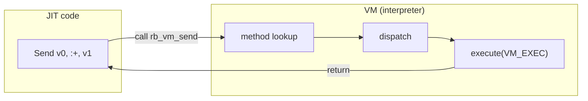
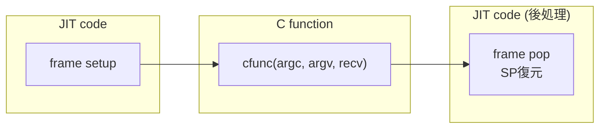
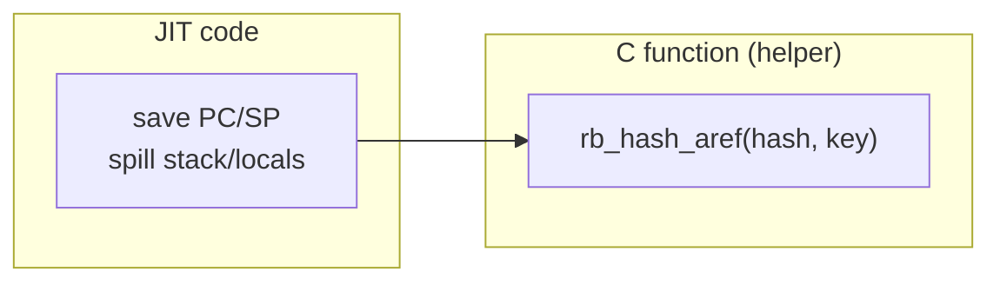
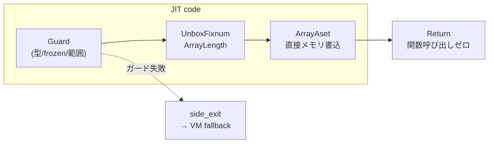

# RubyKaigi 2026 予習Bootcamp 
### 速習JITコンパイラ

### 

2026/03/30 MS芝浦ビル

技術部　土方

---
layout: center
---

# 今日最後ですね

---
layout: center
---

# 最後はJIT CompilerにDeep Diveしていきます

---
layout: center
---

## そもそもVMとはJITとはみたいなのはいいですね...? (skip)

何度か喋っていると思うので

[過去資料はここに](https://github.com/Nozomi-Hijikata/slides)

---
layout: center
---

<div class='flex justify-center' >
  
</div>

---
layout: center
---

## 細かい話をする前に、ひとまず一巡した方がいいと思うので、

※ 正直あの図だけではわかった気がしないと思うので

---
layout: center
---

## Entrypointから順に実装ベースでみていく

---
layout: center
---

### `JIT_EXEC`なるマクロがあり、それをVM命令dispatch時に呼び出すことでEntry

```c
// Run the JIT from the interpreter
#define JIT_EXEC(ec, val) do { \
    /* don't run tailcalls since that breaks FINISH */ \
    if (UNDEF_P(val) && GET_CFP() != ec->cfp) { \
        rb_zjit_func_t zjit_entry; \
        if ((zjit_entry = (rb_zjit_func_t)rb_zjit_entry)) { \
            rb_jit_func_t func = zjit_compile(ec); \
            if (func) { \
                val = zjit_entry(ec, ec->cfp, func); \
            } \
        } \
    } \
} while (0)

```


<Footnotes>
  細かく言えばtop frame用に`jit_exec`もあるが省略
</Footnotes>

---
layout: center
---

### `JIT_EXEC`はsend命令の中で呼び出しされるんでしたね

```c{all|21}{maxHeight: '400px', class:'!children:text-xs'}
//vm.inc
/* insn send(cd, blockiseq)(...)(val) */
INSN_ENTRY(send)
{
    /* ###  Declare that we have just entered into an instruction. ### */
    START_OF_ORIGINAL_INSN(send);
    /* ###  Declare and assign variables. ### */
    CALL_DATA cd = (CALL_DATA)GET_OPERAND(1);
    ISEQ blockiseq = (ISEQ)GET_OPERAND(2);
    VALUE val;
    /* ### Instruction preambles. ### */
    ADD_PC(INSN_ATTR(width));
    POPN(INSN_ATTR(popn));
    //...
    /* ### Here we do the instruction body. ### */
#   define NAME_OF_CURRENT_INSN send
#   line 849 "../ruby/insns.def"
{
    VALUE bh = vm_caller_setup_arg_block(ec, GET_CFP(), cd->ci, blockiseq, false);
    val = vm_sendish(ec, GET_CFP(), cd, bh, mexp_search_method);
    JIT_EXEC(ec, val);

    if (UNDEF_P(val)) {
        RESTORE_REGS();
        NEXT_INSN();
    }
}
#   line 2393 "vm.inc"
#   undef NAME_OF_CURRENT_INSN
    /* ### Instruction trailers. ### */
    //...
    PUSH(val);
#   undef INSN_ATTR
    /* ### Leave the instruction. ### */
    END_INSN(send);
}
```


<Footnotes>
2025 予習Bootcampより再掲
</Footnotes>

---
layout: center
---

### `zjit_compile`でISEQをコンパイル

```c{*|5-10}
// Run the JIT from the interpreter
#define JIT_EXEC(ec, val) do { \
    /* don't run tailcalls since that breaks FINISH */ \
    if (UNDEF_P(val) && GET_CFP() != ec->cfp) { \
        rb_zjit_func_t zjit_entry; \
        if ((zjit_entry = (rb_zjit_func_t)rb_zjit_entry)) { \
            rb_jit_func_t func = zjit_compile(ec); \
            if (func) { \
                val = zjit_entry(ec, ec->cfp, func); \
            } \
        } \
    } \
} while (0)

```
---
layout: default
---

### Counterを使ってCompileの有無を判定

<ol>
  <li>1. 呼び出されるたびにカウンターをincrement</li>
  <li>2. 一定の閾値に達したらprofile用に命令列をZJIT profile用に差し替え</li>
  <li>3. 一定の閾値に達したら<code>rb_zjit_compile_iseq</code>を呼び出してjit compileする</li>
</ol>

```c{*|5|6-10|11-14}{maxHeight: '320px', class:'!children:text-xs'}
static inline rb_jit_func_t zjit_compile(rb_execution_context_t *ec) {
    const rb_iseq_t *iseq = ec->cfp->iseq;
    struct rb_iseq_constant_body *body = ISEQ_BODY(iseq);
    if (body->jit_entry == NULL) {
        body->jit_entry_calls++;
        // At profile-threshold, rewrite some of the YARV instructions
        // to zjit_* instructions to profile these instructions.
        if (body->jit_entry_calls == rb_zjit_profile_threshold) {
            rb_zjit_profile_enable(iseq);
        }
        // At call-threshold, compile the ISEQ with ZJIT.
        if (body->jit_entry_calls == rb_zjit_call_threshold) {
            rb_zjit_compile_iseq(iseq, false);
        }
    }
    return body->jit_entry;
}
```

<Footnotes>
Profilingは後述
</Footnotes>

---
layout: center
---

### `rb_zjit_iseq_gen_entry_point`がRust側のCompile処理を呼び出す

```c{*|9|15}{maxHeight: '400px', class:'!children:text-xs'}
void
rb_zjit_compile_iseq(const rb_iseq_t *iseq, bool jit_exception)
{
    RB_VM_LOCKING() {
        rb_vm_barrier();

        // Compile a block version starting at the current instruction
        uint8_t *rb_zjit_iseq_gen_entry_point(const rb_iseq_t *iseq, bool jit_exception); // defined in Rust
        uintptr_t code_ptr = (uintptr_t)rb_zjit_iseq_gen_entry_point(iseq, jit_exception);

        if (jit_exception) {
            iseq->body->jit_exception = (rb_jit_func_t)code_ptr;
        }
        else {
            iseq->body->jit_entry = (rb_jit_func_t)code_ptr;
        }
    }
}
```

---
layout: center
---

### compileされた`jit_entry`(`func`)を使って`zjit_entry`に処理を移譲

```c{*|7-10}
// Run the JIT from the interpreter
#define JIT_EXEC(ec, val) do { \
    /* don't run tailcalls since that breaks FINISH */ \
    if (UNDEF_P(val) && GET_CFP() != ec->cfp) { \
        rb_zjit_func_t zjit_entry; \
        if ((zjit_entry = (rb_zjit_func_t)rb_zjit_entry)) { \
            rb_jit_func_t func = zjit_compile(ec); \
            if (func) { \
                val = zjit_entry(ec, ec->cfp, func); \
            } \
        } \
    } \
} while (0)
```

---
layout: center
---

### `rb_zjit_entry`もRust側で初期化される

```rust{*|15,19}
/// Initialize ZJIT at boot. This is called even if ZJIT is disabled.
#[unsafe(no_mangle)]
pub extern "C" fn rb_zjit_init(zjit_enabled: bool) {
    // If --zjit, enable ZJIT immediately
    if zjit_enabled {
        zjit_enable();
    }
}

/// Enable ZJIT compilation.
fn zjit_enable() {
    // ...
    let result = std::panic::catch_unwind(|| {
        // Initialize ZJIT states
        let zjit_entry = ZJITState::init();
        //...
        // ZJIT enabled and initialized successfully
        assert!(unsafe{ rb_zjit_entry == null() });
        unsafe { rb_zjit_entry = zjit_entry; }
    });
    //...
}

```

<Footnotes>
`rb_zjit_init`そのものはRuby起動時に呼び出しされる
</Footnotes>

---
layout: center
---

### `zjit_entry`の中身自体は`gen_entry_trampoline`が生成する生ポインタ

```rust{*|5}
impl ZJITState {
    /// Initialize the ZJIT globals. Return the address of the JIT entry trampoline.
    pub fn init() -> *const u8 {
        // たくさん初期化...
        let entry_trampoline = gen_entry_trampoline(&mut cb).unwrap().raw_ptr(&cb);        
        
        //たくさん初期化...

        entry_trampoline
    }
}
```

---
layout: center
---

### `zjit_entry`経由でJITコンパイルされた関数を呼び出す

<ol>
  <li>1. <code>zjit_entry</code>をCから呼び出すためにCのABIに従ってsetup</li>
  <li>2. 渡されたJITコンパイルされた関数を呼び出す</li>
</ol>


```rust{*|6,13|7-10}{maxHeight: '350px', class:'!children:text-xs'}
/// Compile a shared JIT entry trampoline
pub fn gen_entry_trampoline(cb: &mut CodeBlock) -> Result<CodePtr, CompileError> {
    // Set up registers for CFP, EC, SP, and basic block arguments
    let mut asm = Assembler::new();
    asm.new_block_without_id();
    gen_entry_prologue(&mut asm); // EC/SPなどをZJIT側のレジスタにコピーするなどのセットアップ
    // Jump to the first block using a call instruction. This trampoline is used
    // as rb_zjit_func_t in jit_exec(), which takes (EC, CFP, rb_jit_func_t).
    // So C_ARG_OPNDS[2] is rb_jit_func_t, which is (EC, CFP) -> VALUE.
    asm.ccall_reg(C_ARG_OPNDS[2], VALUE_BITS);
    // Restore registers for CFP, EC, and SP after use
    asm.frame_teardown(lir::JIT_PRESERVED_REGS);
    asm.cret(C_RET_OPND);
    let (code_ptr, gc_offsets) = asm.compile(cb)?;
    // ...
    Ok(code_ptr)
}
```

<Footnotes>
VM -> JITのエントリーポイントを集約することで、EC/SPレジスタ退避などの無駄なコード生成を抑えている
</Footnotes>

---
layout: center
---

## ちょっとずつ見えてきましたね！

もうちょい踏み込んで見てみましょう

---
layout: center
---

### `rb_zjit_iseq_gen_entry_point`がRust側のAPIになっておりコンパイル処理が走る


```rust{*|10}{maxHeight: '350px', class:'!children:text-xs'}
/// CRuby API to compile a given ISEQ.
/// If jit_exception is true, compile JIT code for handling exceptions.
/// See jit_compile_exception() for details.
#[unsafe(no_mangle)]
pub extern "C" fn rb_zjit_iseq_gen_entry_point(iseq: IseqPtr, jit_exception: bool) -> *const u8 {
    // Take a lock to avoid writing to ISEQ in parallel with Ractors.
    // with_vm_lock() does nothing if the program doesn't use Ractors.
    with_vm_lock(src_loc!(), || {
        let cb = ZJITState::get_code_block();
        let mut code_ptr = with_time_stat(compile_time_ns, || gen_iseq_entry_point(cb, iseq, jit_exception));
        // ...
        // Always mark the code region executable if asm.compile() has been used.
        // We need to do this even if code_ptr is None because gen_iseq() may have already used asm.compile().
        cb.mark_all_executable();

        code_ptr.map_or(std::ptr::null(), |ptr| ptr.raw_ptr(cb))
    })
}

```

---
layout: center
---

### 順に辿っていくと`compile_iseq` -> `iseq_to_hir`でHIRをコンパイル


```rust{*|4}{maxHeight: '350px', class:'!children:text-xs'}
/// Convert ISEQ into High-level IR
fn compile_iseq(iseq: IseqPtr) -> Result<Function, CompileError> {
    //  ...
    let hir = crate::stats::with_time_stat(Counter::compile_hir_build_time_ns, || iseq_to_hir(iseq));
    let mut function = match hir {
        Ok(function) => function,
        Err(err) => {
            debug!("ZJIT: iseq_to_hir: {err:?}: {}", iseq_get_location(iseq, 0));
            return Err(CompileError::ParseError(err));
        }
    };
    if !get_option!(disable_hir_opt) {
        function.optimize();
    }
    function.dump_hir();
    Ok(function)
}
```

---
layout: center
---

### `iseq_to_hir`でYARVINSNをコンパイル

<ul>
  <li>1. Interpreter/JIT Entry用のBasic Block, 分岐命令に対応したBasic Blockをそれぞれ作る</li>
  <li>2. 作成しておいたBasic Blockに順にYARV INSNをコンパイルしたHIRをBasic Blockに流し込んでいく</li>
</ul>

```rust{*}{maxHeight: '350px', class:'!children:text-xs'}
/// Compile ISEQ into High-level IR
pub fn iseq_to_hir(iseq: *const rb_iseq_t) -> Result<Function, ParseError> {
  // 長すぎるので略...
}
```

<Footnotes>
CFGの枠組みを作る作業と中身を詰める作業を分離することで、コンパイル処理をやりやすくしている
</Footnotes>


---
layout: default
---

### Basic Block (基本ブロック)

- 分岐や合流を含まない、連続した命令の列 / 入口は先頭の1つだけ、出口は末尾の1つだけ
- Basic Blockをノードとし、分岐をエッジとしたグラフが **CFG（制御フローグラフ）**

<div class="flex gap-6 mt-2 items-start">
<div>

```rb
def fib(n)
  if n <= 1
    1
  else
    fib(n-1) + fib(n-2)
  end
end
```

</div>
<div class="text-lg mt-2">→</div>
<pre class="text-xs !leading-tight !p-3">
┌────────────────────────────────────────────┐
│ bb3(v9:BasicObject, v10:BasicObject):      │
│   v15:Fixnum[1] = Const Value(1)           │
│   v18 = Send v10, :<=, v15                 │
│   v21:CBool = Test v18                     │
│   IfFalse v21, bb4(v9, v10)                │
└──────────┬─────────────────────┬───────────┘
           │true                 │false
           ▼                     ▼
┌────────────────────┐ ┌─────────────────────────────────────┐
│ (return)           │ │ bb4(v32:BasicObject,                │
│   v27:Fixnum[1]    │ │     v33:BasicObject):               │
│    = Const Value(1)│ │   v39:Fixnum[1] = Const Value(1)    │
│   Return v27       │ │   v42 = Send v33, :-, v39           │
└────────────────────┘ │   v44 = Send v32, :fib, v42         │
                       │   v50:Fixnum[2] = Const Value(2)    │
                       │   v53 = Send v33, :-, v50           │
                       │   v55 = Send v32, :fib, v53         │
                       │   v58 = Send v44, :+, v55           │
                       │   Return v58                        │
                       └─────────────────────────────────────┘
</pre>
</div>

<Footnotes>
ZJITではbasic block argumentsを採用しており、ブロック間の値の受け渡しを引数で表現する cf. Phi function<br>
※上の図は説明のための概念図であり実態とは一致しない(ZJITではBBを分岐の片側しか作らない様にしている)
</Footnotes>

---
layout: center
---

### `function.optimize`でHIRレイヤーでの種々の最適化を走らせる（後述）


```rust{*|13}{maxHeight: '350px', class:'!children:text-xs'}
/// Convert ISEQ into High-level IR
fn compile_iseq(iseq: IseqPtr) -> Result<Function, CompileError> {
    //  ...
    let hir = crate::stats::with_time_stat(Counter::compile_hir_build_time_ns, || iseq_to_hir(iseq));
    let mut function = match hir {
        Ok(function) => function,
        Err(err) => {
            debug!("ZJIT: iseq_to_hir: {err:?}: {}", iseq_get_location(iseq, 0));
            return Err(CompileError::ParseError(err));
        }
    };
    if !get_option!(disable_hir_opt) {
        function.optimize();
    }
    function.dump_hir();
    Ok(function)
}
```

---
layout: default
---

### `gen_function`でcompileを進める

<ul>
  <li>1. HIRをLIRに変換</li>
  <li>2. LIRをAssemblyに変換</li>
  <li>3. VM entryとJIT entryの開始アドレスを返す※</li>
</ul>


```rust{*|3-6|7-8|16}{maxHeight: '320px', class:'!children:text-xs'}
fn gen_function(cb: &mut CodeBlock, iseq: IseqPtr, version: IseqVersionRef, function: &Function) -> Result<(IseqCodePtrs, Vec<CodePtr>, Vec<IseqCallRef>), CompileError> {
    // ...
    // Compile each basic block
    for (rpo_idx, &block_id) in reverse_post_order.iter().enumerate() {
        // ... 略
    }
    // Generate code if everything can be compiled
    let result = asm.compile(cb);
    result.map(|(start_ptr, gc_offsets)| {
        // Make sure jit_entry_ptrs can be used as a parallel vector to jit_entry_insns()
        jit.jit_entries.sort_by_key(|jit_entry| jit_entry.borrow().jit_entry_idx);

        let jit_entry_ptrs = jit.jit_entries.iter().map(|jit_entry|
            jit_entry.borrow().start_addr.get().expect("start_addr should have been set by pos_marker in gen_entry_point")
        ).collect();
        (IseqCodePtrs { start_ptr, jit_entry_ptrs }, gc_offsets, jit.iseq_calls)
    })
}
```

<Footnotes>
※VMから入る場合、既にcallee frameがpushされているのに対して、JITtoJIT callは直で飛んでくるので必要な処理が違う
</Footnotes>

---
layout: center
---

### `rb_zjit_iseq_gen_entry_point`がVM entry用のCodePtrを返す


```rust{*|16}{maxHeight: '350px', class:'!children:text-xs'}
/// CRuby API to compile a given ISEQ.
/// If jit_exception is true, compile JIT code for handling exceptions.
/// See jit_compile_exception() for details.
#[unsafe(no_mangle)]
pub extern "C" fn rb_zjit_iseq_gen_entry_point(iseq: IseqPtr, jit_exception: bool) -> *const u8 {
    // Take a lock to avoid writing to ISEQ in parallel with Ractors.
    // with_vm_lock() does nothing if the program doesn't use Ractors.
    with_vm_lock(src_loc!(), || {
        let cb = ZJITState::get_code_block();
        let mut code_ptr = with_time_stat(compile_time_ns, || gen_iseq_entry_point(cb, iseq, jit_exception));
        // ...
        // Always mark the code region executable if asm.compile() has been used.
        // We need to do this even if code_ptr is None because gen_iseq() may have already used asm.compile().
        cb.mark_all_executable();

        code_ptr.map_or(std::ptr::null(), |ptr| ptr.raw_ptr(cb))
    })
}
```

---
layout: center
---

### このCodePtrを`rb_zjit_entry`経由で渡して、<br>`call` or `bl/blr`すれば処理が走るということですね...!!!

---
layout: center
---

## とここまでで超ざっくりですが流れを追った形です

---
layout: center
---

## 大枠が見えたところで最適化の話をしましょう

---
layout: default
---

## 最適化の考え方

<ul class="text-sm">
  <v-click>
    <li class="mb-3"><strong class="text-lg" v-mark.circle.orange="4">命令の実行回数を減らす</strong>
      <ul class="text-xs">
        <li>命令を特殊化する</li>
        <li>一度実行した結果を再利用する</li>
        <li>コンパイル時に実行できるもののは実行する</li>
        <li>冗長な命令を削除する</li>
        <li>実行回数を減らす様にプログラムの形を変形する</li>
        <li> etc...</li>
      </ul>
    </li>
  </v-click>
  <v-click>
    <li class="mb-3"><strong class="text-lg">より速い命令を使う</strong>
      <ul class="text-xs">
        <li>レジスタアクセスを利用する</li>
        <li>計算機で使える高性能な命令を利用する</li>
        <li>メモリアクセスの局所性を高めてキャッシュにあたりやすくする</li>
        <li>より単純な命令を利用する</li>
      </ul>
    </li>
  </v-click>
  <v-click>
    <li class="mb-3"><strong class="text-lg">並列度を上げる</strong>
      <ul class="text-xs">
        <li>命令レベルで並列化する（スーパースカラ etc..）</li>
        <li>プロセッサレベルで並列化する (並列計算機（分散メモリ・共有メモリ）)</li>
      </ul>
    </li>
  </v-click>
</ul>

<Footnotes>
  ref: コンパイラの構成と最適化 第2版, 中田育男, 2009<br>
</Footnotes>

---
layout: center
---

## 命令の特殊化が比較的わかりやすいのでみていきましょう


---
layout: default
---

##  JITからのメソッド呼び出しをする方法はざっくり3つ

<ul>
  <v-click>
    <li class="mb-6"><strong class="text-xl">genericな命令を使う</strong>
      <ul>
        <li>VMの処理をそのまま利用する(Fallback)</li>
        <li><code>Send</code> HIR</li>
      </ul>
    </li>
  </v-click>
  <v-click>
    <li class="mb-6"><strong class="text-xl">C定義関数を直接呼ぶ最適化</strong>
      <ul>
        <li>コンパイル時に対象となる関数を確定・実行時のメソッド探索を省く</li>
        <li><code>CCallWithFrame</code>, <code>CCallVariadic</code>... HIR</li>
        <li>いくつかパターンがある</li>
      </ul>
    </li>
  </v-click>
  <v-click>
    <li class="mb-6"><strong class="text-xl">機械語で直接メモリを操作する</strong>
      <ul>
        <li>C関数呼び出しのセットアップを省く/命令流の切り替えにコストがかかる分岐命令(<code>call</code>,<code>bl/blr</code>)を削除できる</li>
        <li>壊れないようにするための前提/ガードが必要</li>
        <li>※残念ながら常に使えるわけではない</li>
      </ul>
    </li>
  </v-click>
</ul>

<Footnotes>
  2026年1月 技術開発全体会より再掲
</Footnotes>


---
layout: default
---

## VMの処理をそのまま利用する(Fallback)

- JIT側で最適化できない場合、VMのdispatch処理をそのまま呼び出す
- メソッド探索・引数セットアップなど全てVM任せ



<Footnotes>
polymorphicなcall siteやprofile情報が不足している場合などにfallbackする
</Footnotes>

---
layout: default
---

## C定義関数を直接呼ぶ最適化1: 汎用CCall

- C定義関数を直接呼ぶパターンその１
- VM frame状態を成立させる必要があるため重い (e.g. 内部で他のRuby場合など)




---
layout: default
---

## C定義関数を直接呼ぶ最適化2: C ABIに従って直接Call

- frameを積まない軽量なdirect c call
- calleeの処理がFrameセットアップを必要としない場合などに限って使える
- <code>HashAref</code>等、特定メソッド用のHIR命令



<Footnotes>
1と比べてframe push/pop・SP/CFP切替が不要なため軽い<br>
PC/SPなどのspill(VM Stackへの同期)が必要なのは例外/GC発生時に対応するため
</Footnotes>

---
layout: default
---

## 機械語で直接メモリを操作する

- C関数すら呼ばず、機械語レベルで直接メモリを読み書きする
- 関数呼び出しのオーバーヘッドが完全に消える
- それ専用の汎用命令を作っていたりする(e.g. `ArrayAset`)



<Footnotes>
全てのガードが通れば関数呼び出しなしで直接メモリ操作 / ガード失敗時はside exitでVMに戻るのでトレードオフ（side exitが多すぎるとNG）
</Footnotes>


<!-- TODO: mark executables調べて盛り込む-->
