```mermaid {scale: 0.7}
graph LR
    A[ソースコード] -->|字句解析| B[トークン列]
    B -->|構文解析| C[構文木（AST）]
    C -->|コンパイル| D[バイトコード]
    D -->|実行| E[VMが実行]
```

# Rubyを速くしている話

2026 1月 技術開発全体会

ジョブハウス開発　土方

---
layout: center
---

# お久しぶりです

---
layout: center
---

# 育休から帰ってきました

---
layout: center
---

# 今日は

---
layout: center
---

# Rubyについての話をしようと思います

---
layout: center
---

# 特にRuby「を」速くする話です


---
layout: center
---

# え

---
layout: center
---

# Ruby「で」じゃないの、、？


---
layout: center
---

# そうなんです


---
layout: center
---

# Rubyを速くしています 🏎️

---
layout: center
---

# 大前提：

## Rubyはプログラムを実行するプログラムですよね


---
layout: center
---

<h1>こんな感じ</h1>
<v-click>
  <h2>VM: バイトコード(Iseq)を扱う仮想的なスタックマシン</h2>
</v-click>

<div class='w-full flex justify-center mt-16'>

</div>


---
layout: default
---

# VMのバイトコード(ISeq)を理解する
## dumpしてみる
``` rb
example = <<~EXAMPLE
  def foo(a,b)
    puts a + b
  end
  foo(9,8)
EXAMPLE

vm = RubyVM::InstructionSequence
vm.compile_option = false
iseq = vm.compile(example)
puts iseq.disasm

```

<p class='text-2xl text-center font-bold'>昨年のRubyKaigi Bootcampより</p>

---
layout: full
---

<div class='flex flex-col justify-center h-full items-center'>
<div class="flex items-center">
<div>
```rb
def foo(a,b)
  ...
end
foo(9,8)
```
</div>
<p class="text-2xl font-bold mx-8">→</p>
<div>
``` {*}{maxHeight: '400px', class:'!children:text-xs'}
== disasm: #<ISeq:<compiled>@<compiled>:1 (1,0)-(4,8)>
0000 definemethod                           :foo, foo                 (   1)[Li]
0003 putself                                                          (   4)[Li]
0004 putobject                              9
0006 putobject                              8
0008 send                                   <calldata!mid:foo, argc:2, FCALL|ARGS_SIMPLE>, nil
0011 leave
```
</div>
</div>

<div class="flex items-center">
<div>
```rb
...
puts a + b
...
```
</div>
<p class="text-2xl font-bold mx-8">→</p>
<div>
```{*}{maxHeight: '400px', class:'!children:text-xs'}
== disasm: #<ISeq:foo@<compiled>:1 (1,0)-(3,3)>
local table (size: 2, argc: 2 [opts: 0, rest: -1, post: 0, block: -1, kw: -1@-1, kwrest: -1])
[ 2] a@0<Arg>   [ 1] b@1<Arg>
0000 putself                                                          (   2)[LiCa]
0001 getlocal                               a@0, 0
0004 getlocal                               b@1, 0
0007 send                                   <calldata!mid:+, argc:1, ARGS_SIMPLE>, nil
0010 send                                   <calldata!mid:puts, argc:1, FCALL|ARGS_SIMPLE>, nil
0013 leave                                                            (   3)[Re]
```
</div>
</div>
</div>


---
layout: center
---

# これだけでは終わらない

---
layout: default
---

# JIT Compilerとは
<h2 v-click>Just in Time Compiler</h2>
<p class='text-xl' v-click>
  ソフトウェアの実行時にソースコードをコンパイルするコンパイラのこと。通常のコンパイラはコンパイルを実行前に事前に行い、これをJITと対比して事前コンパイラ (ahead-of-timeコンパイラ、AOTコンパイラ)と呼ぶ。(<a href="https://ja.wikipedia.org/wiki/%E5%AE%9F%E8%A1%8C%E6%99%82%E3%82%B3%E3%83%B3%E3%83%91%E3%82%A4%E3%83%A9" target="_blank">wikipedia</a>)
</p>

<p class="text-xl" v-click><strong>Rubyだと実行時にYARV命令列の一部を機械語の命令列<span class="text-xs">※</span>に置き換えて実行する方式を取る</strong></p>


<h2 v-click> 他の処理系にもJITがある</h2>
<p class='text-xl' v-click>
JVM(C1, C2, 階層的コンパイラ)やJavaScript(Turbofan), Dart, SmallTalk...など多くの処理系で採用されている
</p>


---
layout: center
---

<h1 class="text-8xl">ZJIT</h1>

---
layout: center
---

<div class='flex justify-center' >
  
</div>


