```mermaid {scale: 0.7}
graph LR
    A[ソースコード] -->|字句解析| B[トークン列]
    B -->|構文解析| C[構文木（AST）]
    C -->|コンパイル| D[バイトコード]
    D -->|実行| E[VMが実行]
```

# Rubyを速くしている話

2026 1月 技術開発全体会

ジョブハウス開発　土方

---
layout: center
---

# お久しぶりです

---
layout: center
---

# 育休から帰ってきました

---
layout: center
---

# 今日は

---
layout: center
---

# Rubyについての話をしようと思います

---
layout: center
---

# 特にRuby「を」速くする話です


---
layout: center
---

# え

---
layout: center
---

# Ruby「で」じゃないの、、？


---
layout: center
---

# そうなんです


---
layout: center
---

# Rubyを速くしています 🏎️

---
layout: center
---

# 大前提：

## Rubyはプログラムを実行するプログラムですよね


---
layout: center
---

<h1>こんな感じ</h1>
<v-click>
  <h2>VM: バイトコード(Iseq)を扱う仮想的なスタックマシン</h2>
</v-click>

<div class='w-full flex justify-center mt-16'>

</div>


---
layout: default
---

# VMのバイトコード(ISeq)を理解する
## dumpしてみる
``` rb
example = <<~EXAMPLE
  def foo(a,b)
    puts a + b
  end
  foo(9,8)
EXAMPLE

vm = RubyVM::InstructionSequence
vm.compile_option = false
iseq = vm.compile(example)
puts iseq.disasm

```

<p class='text-2xl text-center font-bold'>昨年のRubyKaigi Bootcampより</p>

---
layout: full
---

<div class='flex flex-col justify-center h-full items-center'>
<div class="flex items-center">
<div>
```rb
def foo(a,b)
  ...
end
foo(9,8)
```
</div>
<p class="text-2xl font-bold mx-8">→</p>
<div>
``` {*}{maxHeight: '400px', class:'!children:text-xs'}
== disasm: #<ISeq:<compiled>@<compiled>:1 (1,0)-(4,8)>
0000 definemethod                           :foo, foo                 (   1)[Li]
0003 putself                                                          (   4)[Li]
0004 putobject                              9
0006 putobject                              8
0008 send                                   <calldata!mid:foo, argc:2, FCALL|ARGS_SIMPLE>, nil
0011 leave
```
</div>
</div>

<div class="flex items-center">
<div>
```rb
...
puts a + b
...
```
</div>
<p class="text-2xl font-bold mx-8">→</p>
<div>
```{*}{maxHeight: '400px', class:'!children:text-xs'}
== disasm: #<ISeq:foo@<compiled>:1 (1,0)-(3,3)>
local table (size: 2, argc: 2 [opts: 0, rest: -1, post: 0, block: -1, kw: -1@-1, kwrest: -1])
[ 2] a@0<Arg>   [ 1] b@1<Arg>
0000 putself                                                          (   2)[LiCa]
0001 getlocal                               a@0, 0
0004 getlocal                               b@1, 0
0007 send                                   <calldata!mid:+, argc:1, ARGS_SIMPLE>, nil
0010 send                                   <calldata!mid:puts, argc:1, FCALL|ARGS_SIMPLE>, nil
0013 leave                                                            (   3)[Re]
```
</div>
</div>
</div>


---
layout: center
---

# VMだけでは終わらない

---
layout: default
---

# JIT Compilerとは
<h2 v-click>Just in Time Compiler</h2>
<p class='text-xl' v-click>
  ソフトウェアの実行時にソースコードをコンパイルするコンパイラのこと。通常のコンパイラはコンパイルを実行前に事前に行い、これをJITと対比して事前コンパイラ (ahead-of-timeコンパイラ、AOTコンパイラ)と呼ぶ。(<a href="https://ja.wikipedia.org/wiki/%E5%AE%9F%E8%A1%8C%E6%99%82%E3%82%B3%E3%83%B3%E3%83%91%E3%82%A4%E3%83%A9" target="_blank">wikipedia</a>)
</p>

<p class="text-xl" v-click><strong>Rubyだと実行時にYARV命令列の一部を機械語の命令列<span class="text-xs">※</span>に置き換えて実行する方式を取る</strong></p>


<h2 v-click> 他の処理系にもJITがある</h2>
<p class='text-xl' v-click>
JVM(C1, C2, 階層的コンパイラ)やJavaScript(Turbofan), Dart, SmallTalk...など多くの処理系で採用されている
</p>


---
layout: center
---

<h1 class="text-8xl">ZJIT</h1>

---
layout: center
---

<div class='flex justify-center' >
  
</div>


---
layout: default
---

# HIR/LIRとは
VMのバイトコード（おさらい）

```rb
# add.rb
def add(left, right)
  left + right
end

p add(1, 2)
p add(3, 4)
```
```
== disasm: #<ISeq:add@add.rb:2 (2,0)-(4,3)>
local table (size: 2, argc: 2 [opts: 0, rest: -1, post: 0, block: -1, kw: -1@-1, kwrest: -1])
[ 2] left@0<Arg>[ 1] right@1<Arg>
0000 getlocal_WC_0                          left@0                    (   3)[LiCa]
0002 getlocal_WC_0                          right@1
0004 opt_plus                               <calldata!mid:+, argc:1, ARGS_SIMPLE>[CcCr]
0006 leave
```

---
layout: default
---

# HIR: 最適化を行うための抽象化層
### VMのバイトコード
```
== disasm: #<ISeq:add@add.rb:2 (2,0)-(4,3)>
local table (size: 2, argc: 2 [opts: 0, rest: -1, post: 0, block: -1, kw: -1@-1, kwrest: -1])
[ 2] left@0<Arg>[ 1] right@1<Arg>
0000 getlocal_WC_0                          left@0                    (   3)[LiCa]
0002 getlocal_WC_0                          right@1
0004 opt_plus                               <calldata!mid:+, argc:1, ARGS_SIMPLE>[CcCr]
0006 leave
```

### HIR(初期状態)
<v-click>

```
HIR:
fn add:
bb0(v0:BasicObject, v1:BasicObject):
  v4:BasicObject = SendWithoutBlock v0, :+, v1
  Return v4
```

</v-click>

---
layout: default
---

# HIR: 最適化の様子
### HIR(初期状態)
```
HIR:
fn add:
bb0(v0:BasicObject, v1:BasicObject):
  v4:BasicObject = SendWithoutBlock v0, :+, v1
  Return v4
```

### HIR(最適化後)
<v-click>

```
HIR:
fn add:
bb0(v0:BasicObject, v1:BasicObject):
  PatchPoint BOPRedefined(INTEGER_REDEFINED_OP_FLAG, BOP_PLUS)
  v7:Fixnum = GuardType v0, Fixnum
  v8:Fixnum = GuardType v1, Fixnum
  v9:Fixnum = FixnumAdd v7, v8
  Return v9
```

</v-click>

---
layout: default
---

# LIR: プラットフォームごとの機械語への変換を担当
```{*}{maxHeight: '400px', class:'!children:text-xs'}
fn add:
Assembler
    000 Label() -> None
    001 FrameSetup() -> None
    002 LiveReg(A64Reg { num_bits: 64, reg_no: 0 }) -> Out64(0)
    003 LiveReg(A64Reg { num_bits: 64, reg_no: 1 }) -> Out64(1)
# The first GuardType
    004 Test(Out64(0), 1_u64) -> None
    005 Jz() target=SideExit(FrameState { iseq: 0x1049ca480, insn_idx: 4, pc: 0x6000002b2520, stack: [InsnId(0), InsnId(1)], locals: [InsnId(0), InsnId(1)] }) -> None
# The second GuardType
    006 Test(Out64(1), 1_u64) -> None
    007 Jz() target=SideExit(FrameState { iseq: 0x1049ca480, insn_idx: 4, pc: 0x6000002b2520, stack: [InsnId(0), InsnId(1)], locals: [InsnId(0), InsnId(1)] }) -> None
# The FixnumAdd; side-exit if it overflows Fixnum
    008 Sub(Out64(0), 1_i64) -> Out64(2)
    009 Add(Out64(2), Out64(1)) -> Out64(3)
    010 Jo() target=SideExit(FrameState { iseq: 0x1049ca480, insn_idx: 4, pc: 0x6000002b2520, stack: [InsnId(0), InsnId(1)], locals: [InsnId(0), InsnId(1)] }) -> None
    011 Add(A64Reg { num_bits: 64, reg_no: 19 }, 38_u64) -> Out64(4)
    012 Mov(A64Reg { num_bits: 64, reg_no: 19 }, Out64(4)) -> None
    013 Mov(Mem64[Reg(20) + 16], A64Reg { num_bits: 64, reg_no: 19 }) -> None
    014 FrameTeardown() -> None
    015 CRet(Out64(3)) -> None
```

---
layout: default
---

# ASM(機械語):

```
...
# Insn: v7 GuardType v0, Fixnum
0x6376b7ad400f: test dil, 1
0x6376b7ad4013: je 0x6376b7ad4000
# Insn: v8 GuardType v1, Fixnum
0x6376b7ad4019: test sil, 1
0x6376b7ad401d: je 0x6376b7ad4005
# Insn: v9 FixnumAdd v7, v8
0x6376b7ad4023: sub rdi, 1
0x6376b7ad4027: add rdi, rsi
0x6376b7ad402a: jo 0x6376b7ad400a
```

---
layout: center
---

# なんとなく伝わった...?

---
layout: center
---

# ようやく本題


---
layout: center
---

# 今回話すのは`Array#[]=`の高速化

---
layout: center
---

```rb{*}{maxHeight: '500px', class:'!children:text-lg'}
a = [0, 1, 2, 3, 4, 5]
a[0] = "a"
p a  #=> ["a", 1, 2, 3, 4, 5]
a[10] = "x"
p a  #=> ["a", 1, 2, 3, 4, 5, nil, nil, nil, nil, "x"]

a = [0, 1, 2, 3, 4, 5]
a[-100] = 1           #=> IndexError
```


---
layout: default
---

##  JITからのメソッド呼び出しをする方法はざっくり3つ

<ul>
  <v-click>
    <li class="mb-6"><strong class="text-xl">genericな命令を使う</strong>
      <ul>
        <li>VMの処理をそのまま利用する(Fallback)</li>
        <li>`Send`, `SendWithoutBlock` HIR</li>
      </ul>
    </li>
  </v-click>
  <v-click>
    <li class="mb-6"><strong class="text-xl">C定義関数を直接呼ぶ最適化</strong>
      <ul>
        <li>コンパイル時に対象となる関数を確定・実行時のメソッド探索を省く</li>
        <li>`CCall`, `CCallVariadic` HIR</li>
      </ul>
    </li>
  </v-click>
  <v-click>
    <li class="mb-6"><strong class="text-xl">機械語で直接メモリを操作する</strong>
      <ul>
        <li>C関数呼び出しのセットアップを省く/命令流の切り替えにコストがかかる分岐命令(`call`,`bl/blr`)を削除できる</li>
        <li>壊れないようにするための前提/ガードが必要</li>
        <li>※常に使える・使いたいわけではない</li>
      </ul>
    </li>
  </v-click>
</ul>


---
layout: default
---

## `Array#[]=`で考えてみると

<ul>
  <v-click>
    <li class="mb-6"><strong class="text-xl">genericな命令を使う</strong>
      <ul>
        <li>前提あんまりやりたくないケース</li>
      </ul>
    </li>
  </v-click>
  <v-click>
    <li class="mb-6"><strong class="text-xl">C定義関数を直接呼ぶ最適化</strong>
      <ul>
        <li>元々この形</li>
        <li>`rb_ary_store`というC定義の関数があるのでそれに割り当てができる</li>
      </ul>
    </li>
  </v-click>
  <v-click>
    <li class="mb-6"><strong class="text-xl">機械語で直接メモリを操作する</strong>
      <ul>
        <li><strong>条件を満たせばこいつが一番早い</strong></li>
      </ul>
    </li>
  </v-click>
</ul>

---
layout: center
---

# 「条件を満たせば」がちょっと厄介


---
layout: center
---

### `Array#[]=`は配列のサイズ以上のアクセスに対して、<br>追加でメモリ確保をしたり、例外を上げたりする挙動が発生する


---
layout: center
---

## そうなると機械語の処理だけではカバーできなくなる

<v-click>
  <h4>例外やメモリ確保はVMのフレームの存在やGCの処理を前提としているため</h4>
</v-click>


---
layout: center
---

## なのでこれらのケースでは、VMにSideexitする

---
layout: center
---

### HIRの例

```rb
def test(arr)
  arr[1] = 10
end
```
<v-click>

```{*|6-8|10-13|14}{class:'!children:text-normal'}
bb2(v8:BasicObject, v9:BasicObject):
  v16:Fixnum[1] = Const Value(1)
  v18:Fixnum[10] = Const Value(10)
  PatchPoint NoSingletonClass(Array@0x1000)
  PatchPoint MethodRedefined(Array@0x1000, []=@0x1008, cme:0x1010)
  v31:ArrayExact = GuardType v9, ArrayExact
  v32:ArrayExact = GuardNotFrozen v31
  v33:ArrayExact = GuardNotShared v32
  v34:CInt64[1] = UnboxFixnum v16
  v35:CInt64 = ArrayLength v33
  v36:CInt64[1] = GuardLess v34, v35
  v37:CInt64[0] = Const CInt64(0)
  v38:CInt64[1] = GuardGreaterEq v36, v37
  ArrayAset v33, v38, v18
  WriteBarrier v33, v18
  IncrCounter inline_cfunc_optimized_send_count
  CheckInterrupts
  Return v18
```

</v-click>

---
layout: center
---


```rust{*|6-16|18}{maxHeight: '500px', class:'!children:text-xs'}
fn inline_array_aset(fun: &mut hir::Function, block: hir::BlockId...) -> Option<hir::InsnId> {
    if let &[index, val] = args {
        if fun.likely_a(recv, types::ArrayExact, state)
            && fun.likely_a(index, types::Fixnum, state)
        {
            let recv = fun.coerce_to(block, recv, types::ArrayExact, state);
            let index = fun.coerce_to(block, index, types::Fixnum, state);
            let recv = fun.push_insn(block, hir::Insn::GuardNotFrozen { recv, state });
            let recv = fun.push_insn(block, hir::Insn::GuardNotShared { recv, state });

            // Bounds check: unbox Fixnum index and guard 0 <= idx < length.
            let index = fun.push_insn(block, hir::Insn::UnboxFixnum { val: index });
            let length = fun.push_insn(block, hir::Insn::ArrayLength { array: recv });
            let index = fun.push_insn(block, hir::Insn::GuardLess { left: index, right: length, state });
            let zero = fun.push_insn(block, hir::Insn::Const { val: hir::Const::CInt64(0) });
            let index = fun.push_insn(block, hir::Insn::GuardGreaterEq { left: index, right: zero, state });

            let _ = fun.push_insn(block, hir::Insn::ArrayAset { array: recv, index, val });
            fun.push_insn(block, hir::Insn::WriteBarrier { recv, val });
            return Some(val);
        }
    }
    None
}
```


---
layout: center
---

### ガードを入れるとSideexitが発生して、VMに処理が戻ってしまうので、<br>パフォーマンス的には望ましくない

<v-click>
  <h4>事前にある程度、そのパスに入らないことを知っておく必要がある</h4>
</v-click>


---
layout: center
---

```
## Results:

### liquid renderer
              array_aset_fixnum_inline_count:          35
array_aset_fixnum_inline_in_bounds_pos_count:           0
array_aset_fixnum_inline_in_bounds_neg_count:           0
      array_aset_fixnum_inline_oob_pos_count:          35
      array_aset_fixnum_inline_oob_neg_count:           0
### rails bench
              array_aset_fixnum_inline_count:     131,681
array_aset_fixnum_inline_in_bounds_pos_count:     131,675
array_aset_fixnum_inline_in_bounds_neg_count:           6
      array_aset_fixnum_inline_oob_pos_count:           0
      array_aset_fixnum_inline_oob_neg_count:           0
### optcarrot
              array_aset_fixnum_inline_count:     1,018,328
array_aset_fixnum_inline_in_bounds_pos_count:     1,016,305
array_aset_fixnum_inline_in_bounds_neg_count:             0
      array_aset_fixnum_inline_oob_pos_count:         2,023
      array_aset_fixnum_inline_oob_neg_count:             0
### looptimes
              array_aset_fixnum_inline_count:   400,099,942
array_aset_fixnum_inline_in_bounds_pos_count:   400,099,942
array_aset_fixnum_inline_in_bounds_neg_count:             0
      array_aset_fixnum_inline_oob_pos_count:             0
      array_aset_fixnum_inline_oob_neg_count:             0
```


---
layout: center
---
## 大丈夫そう👍

---
layout: center
---
## あとはLIR側への変換処理を作ればよし

---
layout: center
---

```rust{*}{maxHeight: '500px', class:'!children:text-sm'}
fn gen_array_aset(
    asm: &mut Assembler,
    array: Opnd,
    index: Opnd,
    val: Opnd,
) {
    let unboxed_idx = asm.load(index);
    let array = asm.load(array);
    let array_ptr = gen_array_ptr(asm, array);
    let elem_offset = asm.lshift(unboxed_idx, Opnd::UImm(SIZEOF_VALUE.trailing_zeros() as u64));
    let elem_ptr = asm.add(array_ptr, elem_offset);
    asm.store(Opnd::mem(VALUE_BITS, elem_ptr, 0), val);
}
```

---
layout: center
---

### LIR

```{*}{maxHeight: '400px', class:'!children:text-xs'}
# Insn: v31 GuardType v9, ArrayExact
# guard exact class for non-immediate types
Test v4, 7
Jnz Exit(GuardType(ArrayExact))
Cmp v4, Value(0)
Je Exit(GuardType(ArrayExact))
v5 = Load [v4 + 8]
Cmp v5, Value(0x102f23200)
Jne Exit(GuardType(ArrayExact))
# Insn: v32 GuardNotFrozen v31
v6 = Load v4
v7 = Load [v6]
Test v7, 0x800
Jnz Exit(GuardNotFrozen)
# Insn: v33 GuardNotShared v32
v8 = Load v6
v9 = Load [v8]
Test v9, 0x1000
Jnz Exit(GuardNotShared)
# Insn: v34 UnboxFixnum v16
v10 = RShift Value(3), 1
# Insn: v35 ArrayLength v33
v11 = Load v8
v12 = And [v11], 0x3f8000
v13 = RShift v12, 0xf
Test [v11], 0x2000
v14 = CSelNZ v13, [v11 + 0x10]
# Insn: v36 GuardLess v34, v35
Cmp v10, v14
Jge Exit(GuardLess)
# Insn: v37 Const CInt64(0)
# Insn: v38 GuardGreaterEq v36, v37
Cmp v10, Imm(0)
Jl Exit(GuardGreaterEq)
# Insn: v39 ArrayAset v33, v38, v18
v15 = Load v10
v16 = Load v8
Test [v16], 0x2000
v17 = Lea [v16 + 0x10]
v18 = CSelNZ v17, [v16 + 0x20]
v19 = LShift v15, 3
v20 = Add v18, v19
Store [v20], Value(0x15)
# Insn: v40 WriteBarrier v33, v18
# Insn: v41 IncrCounter inline_cfunc_optimized_send_count
# Insn: v25 PatchPoint NoTracePoint
PatchPoint Exit(PatchPoint(NoTracePoint))
# Insn: v26 CheckInterrupts
# RUBY_VM_CHECK_INTS(ec)
VReg32(v21) = Load Mem32[x20 + 0x20]
Test VReg32(v21), VReg32(v21)
Jnz Exit(Interrupt)
# Insn: v27 Return v18
# pop stack frame
v22 = Add x19, 0x38
Mov x19, v22
Mov [x20 + 0x10], x19
LoadInto x0, Value(0x15)
FrameTeardown
CRet x0
PadPatchPoint
```

---
layout: center
---

### Assembly

```{*}{maxHeight: '400px', class:'!children:text-xs'}
# Insn: v31 GuardType v9, ArrayExact
# guard exact class for non-immediate types
0x124eb412c: tst x1, #7
0x124eb4130: b.ne #0x124eb4200
0x124eb4134: cmp x1, #0
0x124eb4138: b.eq #0x124eb4200
0x124eb413c: ldur x0, [x1, #8]
0x124eb4140: ldr x2, #0x124eb4148
0x124eb4144: b #0x124eb4150
0x124eb4148: .byte 0x00, 0x09, 0x8d, 0x05
0x124eb414c: .byte 0x01, 0x00, 0x00, 0x00
0x124eb4150: cmp x0, x2
0x124eb4154: b.ne #0x124eb4200
# Insn: v32 GuardNotFrozen v31
0x124eb4158: mov x0, x1
0x124eb415c: ldur x2, [x0]
0x124eb4160: tst x2, #0x800
0x124eb4164: b.ne #0x124eb4200
# Insn: v33 GuardNotShared v32
0x124eb4168: mov x0, x0
0x124eb416c: ldur x2, [x0]
0x124eb4170: tst x2, #0x1000
0x124eb4174: b.ne #0x124eb4200
# Insn: v34 UnboxFixnum v16
0x124eb4178: mov x2, #3
0x124eb417c: asr x2, x2, #1
# Insn: v35 ArrayLength v33
0x124eb4180: mov x3, x0
0x124eb4184: ldur x4, [x3]
0x124eb4188: and x4, x4, #0x3f8000
0x124eb418c: asr x4, x4, #0xf
0x124eb4190: ldur x5, [x3]
0x124eb4194: tst x5, #0x2000
0x124eb4198: ldur x3, [x3, #0x10]
0x124eb419c: csel x4, x4, x3, ne
# Insn: v36 GuardLess v34, v35
0x124eb41a0: cmp x2, x4
0x124eb41a4: b.ge #0x124eb4200
# Insn: v37 Const CInt64(0)
# Insn: v38 GuardGreaterEq v36, v37
0x124eb41a8: cmp x2, #0
0x124eb41ac: b.lt #0x124eb4200
# Insn: v39 ArrayAset v33, v38, v18
0x124eb41b0: mov x2, x2
0x124eb41b4: mov x0, x0
0x124eb41b8: ldur x3, [x0]
0x124eb41bc: tst x3, #0x2000
0x124eb41c0: add x3, x0, #0x10
0x124eb41c4: ldur x0, [x0, #0x20]
0x124eb41c8: csel x3, x3, x0, ne
0x124eb41cc: lsl x2, x2, #3
0x124eb41d0: adds x3, x3, x2
0x124eb41d4: mov x16, #0x15
0x124eb41d8: stur x16, [x3]
# Insn: v40 WriteBarrier v33, v18
# Insn: v41 IncrCounter inline_cfunc_optimized_send_count
# Insn: v25 PatchPoint NoTracePoint
# Insn: v26 CheckInterrupts
# RUBY_VM_CHECK_INTS(ec)
0x124eb41dc: ldur w0, [x20, #0x20]
0x124eb41e0: tst w0, w0
0x124eb41e4: b.ne #0x124eb4248
# Insn: v27 Return v18
# pop stack frame
0x124eb41e8: adds x19, x19, #0x38
0x124eb41ec: stur x19, [x20, #0x10]
0x124eb41f0: mov x0, #0x15
0x124eb41f4: mov sp, x29
0x124eb41f8: ldp x29, x30, [sp], #0x10
0x124eb41fc: ret
```

---
layout: center
---
## ベンチマークを取るぞ


---
layout: center
---
### loops-timesでのベンチ

<div class="flex-row flex">
<div>
Before
```{*|3}
***ZJIT: Printing ZJIT statistics on exit***
Top-20 not inlined C methods (100.0% of total 400,106,363):
              Array#[]=: 400,099,942 (100.0%)
       Numeric#nonzero?:       1,686 ( 0.0%)
               String#+:         737 ( 0.0%)
             File.file?:         737 ( 0.0%)
             Array#any?:         593 ( 0.0%)
          Regexp#match?:         565 ( 0.0%)
              String#-@:         286 ( 0.0%)
           String#split:         230 ( 0.0%)
          String#chomp!:         230 ( 0.0%)
       File.expand_path:         218 ( 0.0%)
  String#delete_prefix!:         196 ( 0.0%)
              String#[]:         196 ( 0.0%)
     String#start_with?:         196 ( 0.0%)
       String#end_with?:         196 ( 0.0%)
            String#to_i:         119 ( 0.0%)
           String#gsub!:          90 ( 0.0%)
           String#strip:          90 ( 0.0%)
            File.exist?:          20 ( 0.0%)
             Array#join:          13 ( 0.0%)
          Array#compact:          13 ( 0.0%)
```
</div>

<div>
After
```
***ZJIT: Printing ZJIT statistics on exit***
Top-20 not inlined C methods (100.0% of total 5,833):
       Numeric#nonzero?: 1,591 (27.3%)
             File.file?:   686 (11.8%)
               String#+:   686 (11.8%)
             Array#any?:   550 ( 9.4%)
          Regexp#match?:   449 ( 7.7%)
              String#-@:   262 ( 4.5%)
           String#split:   213 ( 3.7%)
          String#chomp!:   213 ( 3.7%)
       File.expand_path:   200 ( 3.4%)
  String#delete_prefix!:   182 ( 3.1%)
       String#end_with?:   182 ( 3.1%)
     String#start_with?:   182 ( 3.1%)
              String#[]:   182 ( 3.1%)
           String#gsub!:    80 ( 1.4%)
           String#strip:    80 ( 1.4%)
            String#to_i:    58 ( 1.0%)
            File.exist?:    17 ( 0.3%)
          Array#compact:     9 ( 0.2%)
             Array#join:     9 ( 0.2%)
       Module#const_set:     1 ( 0.0%)
```
</div>
</div>


---
layout: center
---
## 4億回の`Array#[]=`呼び出しを削減できた！！


---
layout: center
---
## 手元のベンチマークで5%改善
- before patch: Average of last 10, non-warmup iters: <strong>3557</strong>ms
- after patch: Average of last 10, non-warmup iters: <strong>3362</strong>ms

---
layout: center
---

<h2 class="text-center">無事マージ🎉</h2>

<div class='flex justify-center' >
  
</div>

---
layout: center
---

<h2 class="text-center">ruby-bench側でも明確に上がっている!!🚀</h2>
<p class="text-center">※取り込まれたのが2026/1/8</p>

<div class='flex justify-center' >
  
</div>

---
layout: center
---
# そんなこんなで

---
layout: center
---

<h2 class="text-center">1月からの累計で</h2>

<div class='flex justify-center items-center flex-col gap-2'>
<v-click>
  
</v-click>
<v-click>
  
</v-click>
<v-click>
  
</v-click>
<v-click>
  
</v-click>
<v-click>
  
</v-click>
<v-click>
  
</v-click>
  
</div>


---
layout: default
---
# 感想

<v-click>
<h3> 1. CRuby Contributionデビュー！(素直に嬉しいね)</h3>
<h4>JITを通じてたくさんのことを学ぶことができる</h4>
</v-click>

<v-click>
<h3> 2. ShopifyのJITチームやRubyメンテナーの方々と交流できるのもOSSの魅力</h3>
</v-click>

<v-click>
  <div class='flex justify-center flex-row gap-4' >
    
    
  </div>
</v-click>


---
layout: center
---

# おわり

